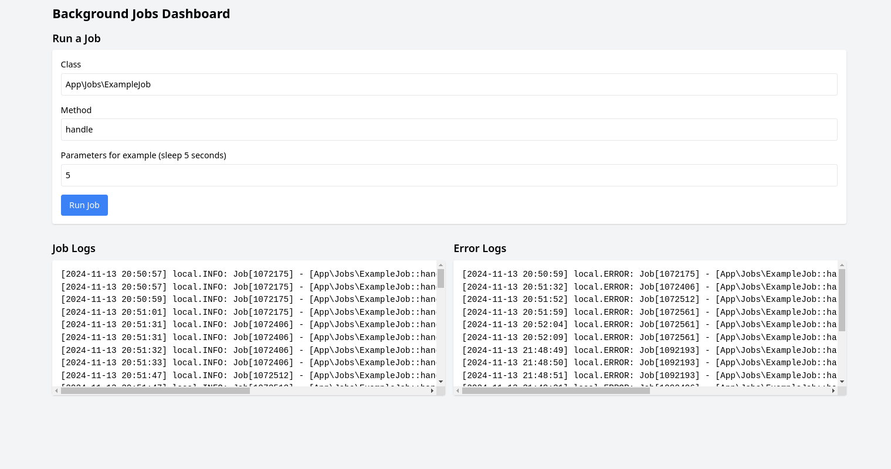

# Customs Background Jobs System

## Introduction

This application provides a system for executing background jobs in Laravel applications.

## Key Features

- **Independence from Laravel's Queue System**: Operates autonomously, providing greater flexibility and control.
- **Error Handling**: Provides mechanisms for error logs .
- **Operating System Integration**: Processes are queued directly by the operating system, allowing for more granular control over job priority and cancellation.

## How It Works

The system uses Laravel console commands to queue and manage jobs. Processes are handled at the operating system level, allowing for efficient management of priority and the ability to cancel running jobs.

## Available Commands

| Command | Description |
|---------|-------------|
| `job:cancel` | Cancel a running command by sending a SIGTERM signal |
| `job:run` | Run a background job |

## How to Run a Job

To run a specific job, you can use the `job:run` command. The general syntax is as follows:

```
./artisan job:run [jobName] [method] --params=[parameters]
```
### Example

To run the `App\Jobs\ExampleJob` job with the `handle` method and pass the parameter `0`, use the following command:

```
./ artisan job:run 'App\Jobs\ExampleJob' 'handle' --params=0
```

## Cancelling a Job

To cancel a running job, you can use the `job:cancel` command. This sends a SIGTERM signal to the running process. Here's an example:

```
./artisan job:cancel [jobId]
```


### Running a Background Job

To run a background job, use the `runBackgroundJob` function:
```php
runBackgroundJob(ExampleJob::class, 'handle', 'param1');
```

The function takes three parameters:
- `$class`: The fully qualified class name of the job to run.
- `$method`: The name of the method to call on the job class.
- `$params`: An array of parameters to pass to the job method.


### Retry Mechanism

The retry mechanism is handled automatically based on the configuration in `config/background-jobs.php`. If a job fails, it will be retried up to `max_retries` times with a delay of `retry_delay` seconds between attempts.

### Job Priority

Currently, job priority is not implemented in this version. Jobs are executed in the order they are received.


## Web-Based Dashboard

A simple web interface is provided to monitor and manage background jobs:

1. Access the dashboard at `/`
2. View job logs and error logs
3. Run new jobs directly from the interface


## Security Requirements:

- Only classes listed in the `allowed_classes` configuration can be run as background jobs.
- Class and method names are validated before execution to prevent unauthorized code execution.
  
  1. Update the `config/background-jobs.php` file to add your allowed job classes:
        ```php
        return [
        'allowed_classes' => [
            \App\Jobs\ExampleJob::class,
            // Add other allowed classes here
        ],
            'max_retries' => 3,
            'retry_delay' => 60, // in seconds
        ];

## Logging

- Successful job executions are logged in `storage/logs/background_jobs.log`
- Failed job executions and errors are logged in `storage/logs/background_jobs_errors.log`


## Writing a test job example

To add new job classes:

1. Create a new class in the `App\Jobs` namespace
2. Implement a `handle` method (or any other method you want to call)
3. Add the class to the `allowed_classes` array in the configuration file


Example:

```php
 namespace App\Jobs;


class NewJob
{
    public function handle($param)
    {
        // Job logic here
    }
}

```

Then add `\App\Jobs\NewJob::class` to the `allowed_classes` array in `config/background-jobs.php`.


### Config custom jobs
1. Update the `config/background-jobs.php` file to add your allowed job classes:

   ```php
   return [
    'allowed_classes' => [
        \App\Jobs\ExampleJob::class,
        // Add other allowed classes here
    ],
       'max_retries' => 3,
       'retry_delay' => 60, // in seconds
    ];
2. Make sure your `config/logging.php` file includes the custom log channels for background jobs.


### Config logging channels
1. Update the `config/logging.php` file to add the custom log channels for background jobs:

   ```php
   return [
       'channels' => [
        'background_jobs' => [
            'driver' => 'single',
            'path' => storage_path('logs/background_jobs.log'),
            'level' => 'debug',
        ],

        'background_jobs_errors' => [
            'driver' => 'single',
            'path' => storage_path('logs/background_jobs_errors.log'),
            'level' => 'error',
        ],
       ]
    ]


## How to run the project with Docker

This project uses the Sail tool, which allows us to run the project with Docker. To do this, we need to execute the following commands:

1 - Clone the repository

```bash

git clone https://github.com/andresmazza/background_jobs.git
```